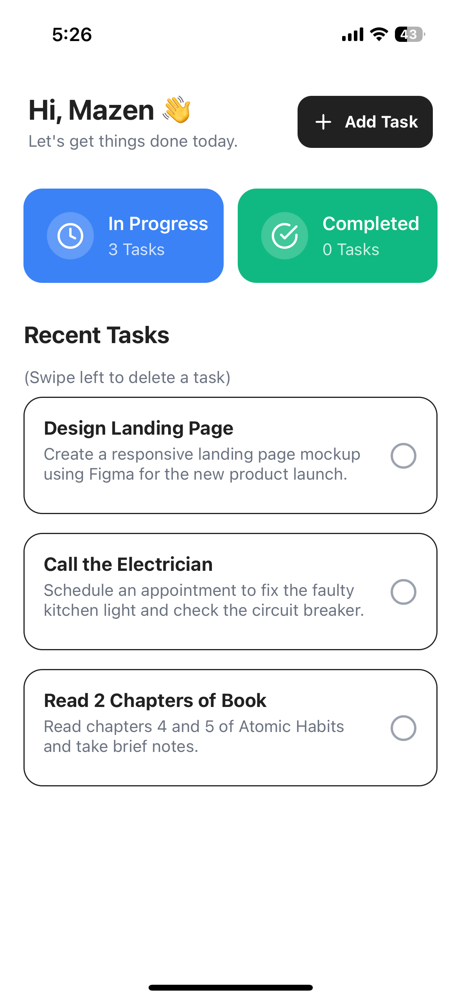
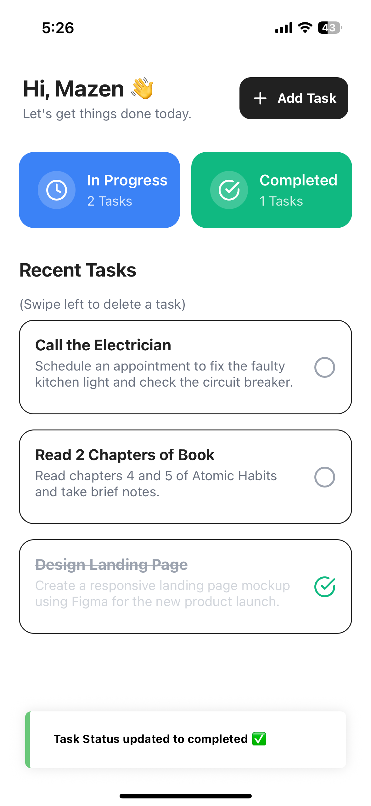
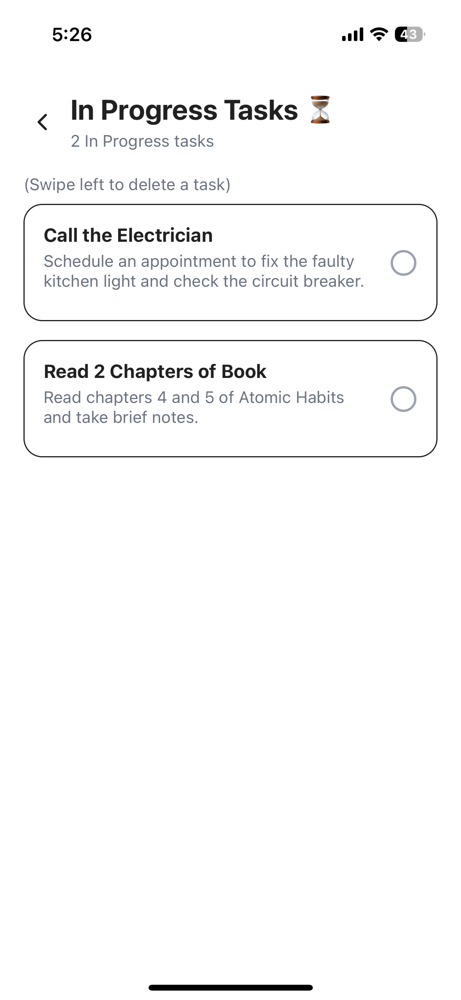
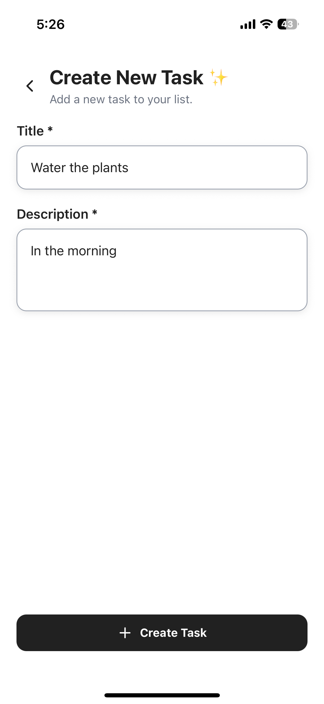
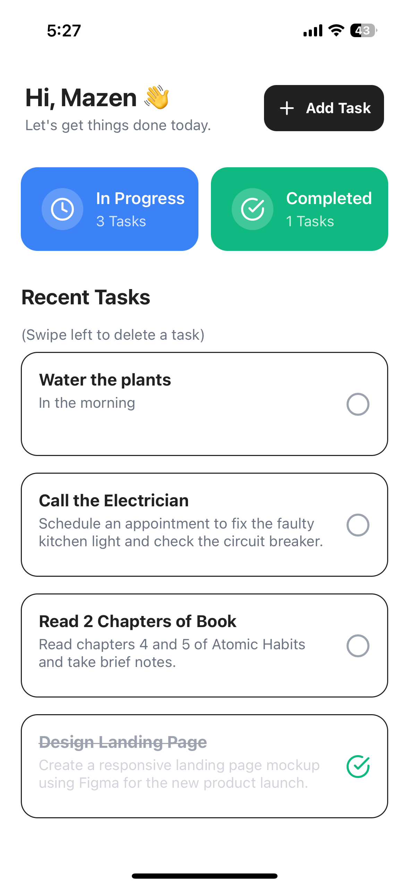
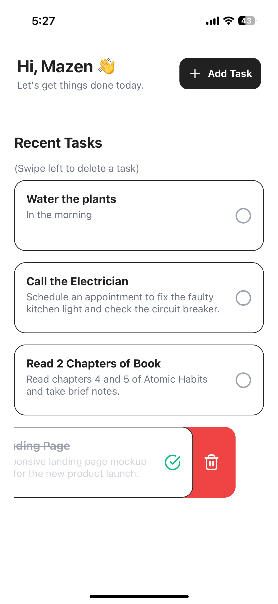
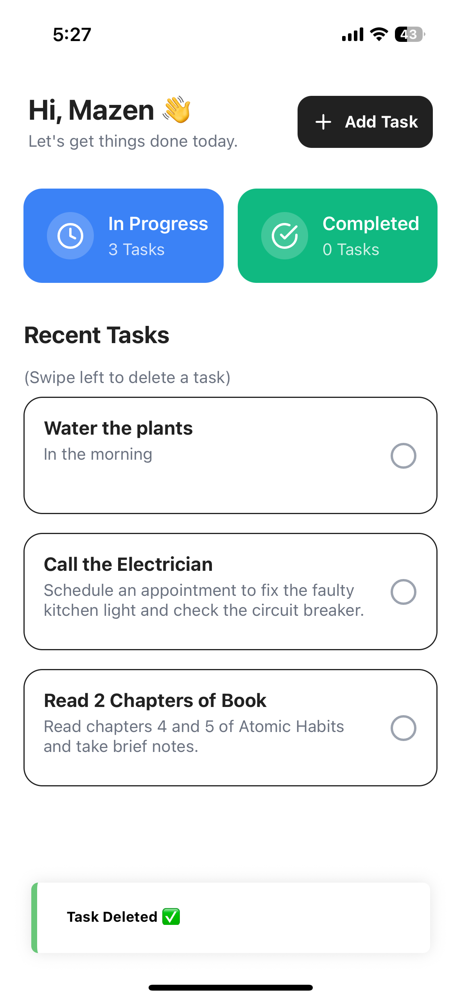

# Todo App 📝

A modern, feature-rich todo application built with React Native and Expo. This app helps you manage your daily tasks with an intuitive interface and seamless user experience.

## 🚀 Features

### Core Functionality
- **Task Management**: Create, view, and manage tasks with titles and descriptions
- **Status Tracking**: Track task progress with "In Progress" and "Completed" statuses
- **Task Actions**: Mark tasks as complete/incomplete and delete tasks
- **Smart Sorting**: Tasks are automatically sorted by last updated time
- **Status Overview**: Dashboard cards showing task counts by status

### User Experience
- **Personalized Greeting**: Welcome message with user name
- **Form Validation**: Input validation with helpful error messages
- **Toast Notifications**: Success feedback when tasks are created
- **Responsive Design**: Clean, modern UI
- **Navigation**: Smooth navigation between screens with back button support

## 🛠 Setup Instructions

### Prerequisites
- **Node.js**
- **npm**
- **Expo CLI**

### Installation

1. **Clone the repository**
   ```bash
   git clone https://github.com/MazenTayseer/Todo-app.git
   cd todo-app
   ```

2. **Install dependencies**
   ```bash
   npm install
   ```

3. **Start the development server**
   ```bash
   npx expo start
   ```

## 📱 How to Use

1. **Home Screen**: View your task overview with status cards and recent tasks
2. **Add Task**: Tap the "Add Task" button to create a new task
3. **Fill Details**: Enter a title and description for your task
4. **Recent Tasks**: Shows your recent added tasks, either in progress or completed, sorted by updated at time
5. **Status Cards**: Shows number of tasks in each category, you can press them in view tasks in each category separately

## 📚 Third-Party Libraries
e
### UI & User Experience
- **@expo/vector-icons (^14.1.0)**: Comprehensive icon library for Expo
- **react-native-toast-message (^2.3.1)**: Toast notifications for user feedback
- **react-native-gesture-handler**: For a swipeable component, for deleting tasks

### Utilities & Data Management
- **uuid (^11.1.0)**: Generate unique identifiers for tasks
- **react-native-get-random-values (^1.11.0)**: Polyfill for crypto.getRandomValues (required by uuid)

## 📱 App Screenshots

### Home Screen & Marking as Complete
<div align="center">
  
  
</div>

### Tasks by Status
<div align="center">
  
  
</div>

### Adding a New Task
<div align="center">
  
  
</div>

### Deleting a Task
<div align="center">
  
  
</div>

